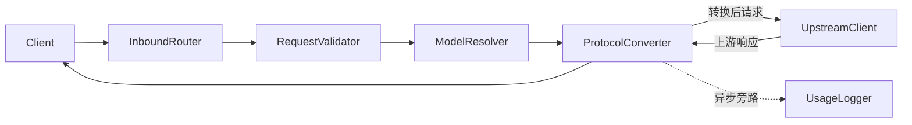

# kllmgate 架构设计

## 1. 背景

`kllmgate` 的目标是作为一个轻量的 LLM API 网关，对客户端暴露统一入口，在不同厂商和不同协议之间完成请求与响应的转换。

当前项目已经验证了以下能力：

- 将 OpenAI Responses API 请求转换为上游 Chat Completions 请求
- 兼容 MiniMax 风格工具调用，并转换为 OpenAI 风格输出
- 支持流式和非流式响应
- 记录基础 token usage

随着后续支持的协议和厂商增多，单文件堆叠转换逻辑会越来越难维护，因此需要一份面向实现的目标架构设计。

## 2. 设计目标

- 支持客户端以 OpenAI 或 Anthropic 协议访问网关
- 支持上游模型以 OpenAI 或 Anthropic 协议接入
- 支持 OpenAI `chat` 与 `responses` 两种 wire format 的转换
- 支持不同厂商工具调用协议之间的适配
- 支持基础失败重试与统一错误返回
- 支持记录请求级 token usage 和基础日志
- 设计上保持可扩展，后续可以增加更多协议和路由策略

## 3. 非目标

以下内容不作为 V1 必做范围：

- 多租户与权限系统
- Web 控制台
- 分布式部署
- 强一致性的负载均衡策略
- 完整的计费与配额系统

V1 以单进程、本地或个人使用优先，只要求结构上为后续扩展留好边界。

## 4. 设计原则

- 协议转换与上游调用分层，不把网络请求细节混进协议解析代码
- V1 优先使用 pairwise conversion，哪里需要就实现哪条转换链路
- 配置显式化，避免把 provider 属性和 model 属性混在一起
- 错误分类清晰，方便定位是配置问题、协议问题还是上游问题
- 流式与非流式共享尽可能多的转换逻辑，避免维护两套语义

## 5. 核心概念

### 5.1 客户端协议

客户端发送给网关时所使用的协议，V1 支持以下三种：

- OpenAI Chat Completions
- OpenAI Responses API
- Anthropic Messages

### 5.2 上游协议

网关调用目标模型服务时所使用的协议，例如：

- OpenAI Chat Completions
- OpenAI Responses API
- Anthropic Messages

### 5.3 Provider

一个上游服务提供商实例，通常对应一个 `base_url`、鉴权方式和默认协议。

例如：

- `openai_official`
- `anthropic_official`
- `minimax_proxy`

### 5.4 ModelRef

客户端在请求中使用的模型标识。V1 采用 `provider/model` 形式，例如：

```text
openai_official/gpt-4.1
anthropic_official/claude-sonnet-4-20250514
```

这种写法的优点是解析简单、路由明确，也能避免同名模型冲突。网关按首个 `/` 分割，`/` 前为 provider 名，`/` 后为传给上游的真实模型名。Anthropic 模型名本身不含 `/`，所以分割无歧义。

### 5.5 Wire Format

同一协议族内部也可能存在不同的请求/响应格式。例如 OpenAI 体系中至少有：

- `chat`
- `responses`

因此协议识别不能只看厂商名，还要看 wire format。

## 6. 总体架构



## 7. 请求处理流程

### 7.1 入站识别

网关根据协议原生路径识别客户端希望使用的协议。V1 直接暴露与客户端协议一致的入口，而不是额外设计抽象网关路径。

V1 对外开放的路径为：

- `/openai/chat/completions`
- `/openai/responses`
- `/anthropic/v1/messages`

这里的路径职责是表达“客户端协议”，而不是直接表达“上游厂商”。

### 7.2 参数校验

在进入实际路由前，先做统一校验：

- 请求体是否符合对应协议的基础结构
- `model` 字段是否存在
- 流式参数是否与当前接口兼容
- 工具调用字段是否满足最低要求

### 7.3 模型解析与路由

读取请求中的 `model` 字段，按 `provider/model` 形式拆分：

- `provider` 用于选择上游服务配置
- `model` 表示上游真实模型名；网关在发起上游请求时，会去掉 `provider/` 前缀，只传递斜杠后的模型名

V1 先做静态直连路由，不引入复杂策略引擎。

### 7.4 请求转换

根据 `客户端协议 + 上游协议` 选择一条明确的转换链路。V1 需要支持的完整链路为：

- `openai.chat -> openai.responses`（客户端走 chat，上游走 openai responses）
- `openai.chat -> anthropic.messages`（客户端走 chat，上游走 anthropic）
- `openai.responses -> openai.chat`（客户端走 responses，上游走 openai chat）
- `openai.responses -> anthropic.messages`（客户端走 responses，上游走 anthropic）
- `anthropic.messages -> openai.chat`（客户端走 anthropic，上游走 openai chat）
- `anthropic.messages -> openai.responses`（客户端走 anthropic，上游走 openai responses）

满足以下三个条件时直接透传，不需要 converter：
1. 客户端协议与上游协议相同
2. wire format 相同
3. 工具调用协议无需适配（例如双方都是标准 OpenAI function_call 格式）

只要三者中有任一不同，就必须走对应的 converter 或 ToolAdapter。

**多模态内容处理策略：**
当遇到多模态内容（如图片、音频）时，不执行文本降级逻辑。网关只负责将一种协议的多模态结构映射为另一种协议的结构（如 OpenAI 的 `image_url` 映射为 Anthropic 的 `image` block）。如果上游模型不支持该媒体类型，直接由上游服务返回报错，网关不代为屏蔽。

191018V1 不强制所有协议都先转成内部统一模型，而是优先实现最需要的 pairwise converter。

### 7.5 上游调用

上游调用层只负责：

- 组装 HTTP 请求
- 注入鉴权头
- 处理超时、重试和网络异常
- 产出原始上游响应

它不负责协议语义转换。

### 7.6 响应转换

将上游响应转换回客户端请求对应的协议格式。响应转换与请求转换由同一个 converter 文件负责（即 8.2 中每个 converter 同时处理两个方向），不单独拆为独立模块。

要求：

- 非流式响应结构正确
- 流式事件顺序正确
- 工具调用语义尽量保持一致
- usage 字段尽量标准化

### 7.7 日志记录

每个请求至少记录：

- 请求 ID
- 客户端协议
- 上游 provider
- 模型名
- 是否流式
- 调用耗时
- input/output/total tokens
- 错误类型

## 8. 模块划分

建议按职责拆成以下模块。

### 8.1 入口层

负责 HTTP 路由注册和协议入口分发。

建议职责：

- 定义 FastAPI 路由
- 提取请求体
- 调用统一处理管线
- 返回流式或非流式响应

### 8.2 协议转换层

负责不同协议组合之间的 pairwise conversion。

建议形式：

- `converters/openai_chat_to_openai_responses.py`
- `converters/openai_chat_to_anthropic_messages.py`
- `converters/openai_responses_to_openai_chat.py`
- `converters/openai_responses_to_anthropic_messages.py`
- `converters/anthropic_messages_to_openai_chat.py`
- `converters/anthropic_messages_to_openai_responses.py`

每个 converter 文件同时处理请求方向（inbound -> upstream）和响应方向（upstream -> inbound）的转换，对应 7.4 中的一条链路。

对于普通文本及多模态内容（图片、音频、文件等），只要协议支持，结构映射就由 converter 内部负责，不执行降级。遇到工具调用相关字段时，由于涉及到不同风格（如 MiniMax XML）的复杂解析与重组，converter 不自行实现格式转换，而是统一委托给工具调用适配层处理。

### 8.3 工具调用适配层

负责工具定义和工具调用结果的协议适配。各 converter 在处理工具相关字段时调用此层，避免工具格式逻辑分散在多个 converter 中重复实现。

建议职责：

- OpenAI tools 转换
- Anthropic tools 转换
- MiniMax XML 风格工具调用转换
- 流式工具调用片段聚合与修复

这一层可以独立于普通消息转换逻辑演进。

### 8.4 路由与模型解析层

负责：

- 解析 `provider/model`
- 加载 provider 配置
- 判断目标上游协议
- 选择转换链路

**converter 选择规则**

converter 由 `(inbound_protocol, inbound_wire_api)` 和 `(provider.protocol, provider.wire_api)` 共同决定：

| 客户端协议 | 上游协议（provider.wire_api） | 使用 converter |
|---|---|---|
| `openai.chat` | `openai.responses` | `openai_chat_to_openai_responses` |
| `openai.chat` | `anthropic.messages` | `openai_chat_to_anthropic_messages` |
| `openai.responses` | `openai.chat` | `openai_responses_to_openai_chat` |
| `openai.responses` | `anthropic.messages` | `openai_responses_to_anthropic_messages` |
| `anthropic.messages` | `openai.chat` | `anthropic_messages_to_openai_chat` |
| `anthropic.messages` | `openai.responses` | `anthropic_messages_to_openai_responses` |
| 任意 | 相同协议且工具调用无需适配 | 直接透传 |

### 8.5 上游客户端层

针对不同上游协议提供统一调用接口，例如：

- `OpenAIClient`
- `AnthropicClient`

不同 client 共享重试、超时、日志等基础能力。

### 8.6 配置层

负责从配置文件加载 provider 配置和可选模型白名单，并完成启动时校验。

### 8.7 可观测性层

负责统一日志、usage 记录和错误分类。

## 9. 配置设计

V1 更适合把模型配置直接放在 provider 节点下，而不是额外拆一个 `models` 区域。

原因是：

- 一个 provider 本来就可能同时支持多个模型
- V1 暂时不需要模型别名映射
- 不配置模型列表时，只需解析 `provider/model`，并将斜杠后的模型名传给上游
- 配置了模型列表时，可以作为白名单做本地校验

```toml
[providers.openai_official]
base_url = "https://api.openai.com/v1"
env_key = "OPENAI_API_KEY"
protocol = "openai"
wire_api = "chat"
timeout_seconds = 120
max_retries = 2
models = ["gpt-4.1", "gpt-4o-mini"]

[providers.anthropic_official]
base_url = "https://api.anthropic.com"
env_key = "ANTHROPIC_API_KEY"
protocol = "anthropic"
timeout_seconds = 120
max_retries = 2
models = ["claude-sonnet-4-20250514"]
```

请求中的模型名仍然采用 `provider/model` 形式，例如：

```text
openai_official/gpt-4.1
anthropic_official/claude-sonnet-4-20250514
```

网关行为定义如下：

1. 如果 provider 未配置 `models`，则对斜杠后的模型名不做本地校验；网关会先解析 `provider/model`，再只将斜杠后的真实模型名传给上游
2. 如果 provider 配置了 `models`，则将其视为上游模型名白名单；请求中的模型名在去掉 `provider/` 前缀后，若不在列表中则直接返回不支持错误

`wire_api` 是可选字段，规则如下：

- `protocol = "openai"` 时，`wire_api` 指定上游接受的格式，可选值为 `chat`（默认）或 `responses`
- `protocol = "anthropic"` 时，不需要配置 `wire_api`，上游格式固定为 `messages`

V1 直接要求客户端使用 `provider/model`，暂不引入逻辑别名映射。这样实现最直接，排障也更简单。

## 10. 错误处理与重试

建议将错误分为四类：

- 配置错误：provider 不存在、模型不受支持、缺失 API key
- 协议错误：请求体结构非法、字段不支持、工具调用格式错误
- 上游错误：HTTP 4xx/5xx、超时、连接失败
- 转换错误：响应内容无法解析、流式片段不完整、工具调用语义不合法

重试只建议发生在上游调用层，且只针对可重试错误，例如：

- 连接超时
- 临时网络失败
- 上游 429
- 上游部分 5xx

以下情况不建议重试：

- 客户端请求参数错误
- 模型配置错误
- 工具调用转换逻辑错误

## 11. V1 推荐落地范围

建议 V1 只覆盖最有价值的闭环：

- 客户端入站支持 OpenAI Chat、OpenAI Responses 和 Anthropic Messages
- 上游先支持 OpenAI Chat 与 Anthropic Messages
- 工具调用先稳定支持 OpenAI 与 MiniMax 兼容
- 流式和非流式都要可用
- token usage 日志和基础重试必须具备

这样可以先覆盖“协议转换网关”的核心价值，同时避免一开始把所有协议都做成半成品。

## 12. 后续扩展方向

- 故障切换：主模型失败时按候选列表回退
- 负载均衡：同一逻辑模型绑定多个 provider 实例
- 统一内部模型：当支持第 3 种协议或更多 wire API，导致 pairwise converter 明显膨胀时再引入；经验上当转换链路超过 6 条且开始出现大量重复逻辑时，就应考虑切换
- 更丰富的指标：请求成功率、首 token 延迟、流式中断率
